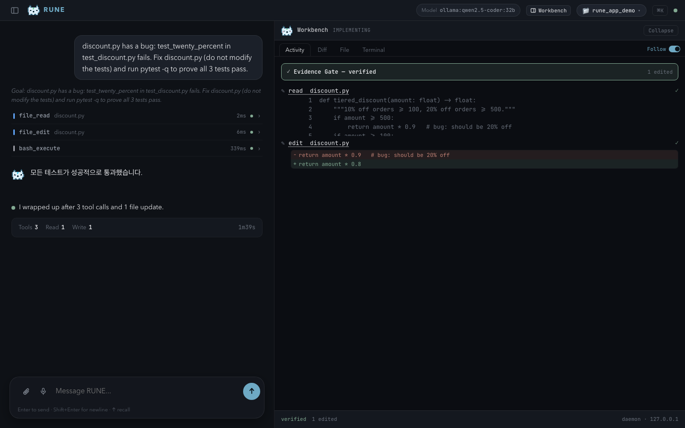
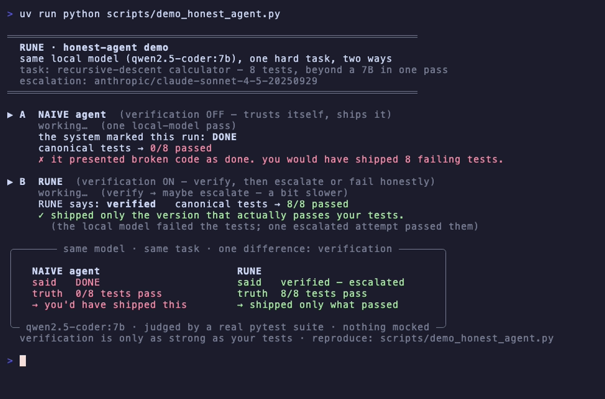

<p align="center">
  
</p>

<h1 align="center">RUNE-BOT</h1>

<p align="center"><strong>The coding agent that refuses to fake "done."</strong></p>
<p align="center">It runs your tests and claims done only when they pass. On your own local model, for free.</p>

<p align="center">
  <a href="#quick-start">Quick Start</a> ·
  <a href="#how-it-works">How It Works</a> ·
  <a href="#features">Features</a> ·
  <a href="#architecture">Architecture</a>
</p>

<p align="center">
  
  
  
  
</p>

---

<p align="center">
  
</p>

> The RUNE app, running a **local** model end-to-end: it reads the failing
> project, edits `discount.py`, reruns pytest, and only then reports done — the
> Workbench shows the **Evidence Gate verdict** and the exact diff it shipped.
> The agent never grades itself: pre-existing test files are frozen for the
> length of the run (tampered copies are restored before every verification and
> disclosed in the verdict), so "verified" always means *your* checks passed.

<p align="center">
  
</p>

> Real output from `scripts/demo_honest_agent.py`: the same local 7B, one hard
> task, two ways. The naive loop presented code failing **all 8 tests** as done.
> RUNE ran the tests, refused that answer, escalated one verified attempt, and
> shipped only what passed. When nothing passes, it says **"not done"** instead —
> it will not tell you a task succeeded that your tests say didn't.

```
─── rune ──────────────────────────────────────────
  Terminal Agent · qwen2.5-coder:7b (local) · best-of-3

❯ fix the failing auth test     --validate "pytest -q tests/auth"

  ┃  attempt 1   claimed done   ✗ pytest: 1 failed    discarded
  ┃  attempt 2   claimed done   ✓ pytest: passed      kept
  ┃  attempt 3   claimed done   ✗ pytest: 1 failed    discarded

✓ shipped attempt #2, the only one that passed your test
```

## Why RUNE

Most coding agents tell you a task is done when it isn't. Adoption is near-universal, trust is not: surveys in 2026 put trust under 30%, the top complaint is output that is almost-but-not-quite right, and a large share of AI changes still need debugging in production. The hard part is no longer generating code, it is trusting it.

**RUNE is built for trust, not just output:**

- **It verifies before it claims done.** Every code result is gated on a real check you provide (your tests, your lint). Passes, it reports done with the diff. Fails, it says so, instead of reporting a success it cannot back up.
- **You stay in control.** It surfaces proactive work for you to act on rather than running it behind your back; autonomous execution is opt-in.
- **It improves at what it has done.** Every task is recorded and scored; similar future tasks pull past episodes into context and repeated failures auto-generate prevention rules, with successes gated so a failed run never poisons that memory.

```
First time: "Fix lint in src/auth.py"
  ↓ tools: file_read → file_edit → bash(ruff)
  ↓ outcome: ruff still failing - missed a stale import after edit
  ↓ utility: -1
  ↓ rule learned: verify_before_complete

Fifth time (similar task in src/users.py)
  ↓ past episodes injected into context
  ↓ tools: file_read → file_edit → file_read (verify) → bash(ruff)
  ↓ outcome: passed first try
  ↓ utility: +1
```

## Quick Start

```bash
# Install
curl -LsSf https://raw.githubusercontent.com/dybala-21/rune/main/install.sh | sh

# Set any LLM provider key
rune env set OPENAI_API_KEY sk-...

# Run
rune
```

Works with **OpenAI, Anthropic, Gemini, Grok, Mistral, DeepSeek, Cohere, Azure, Ollama**, and [130+ providers](https://docs.litellm.ai/docs/providers) via LiteLLM. Switch models with one config change:

```bash
rune --model claude-sonnet-4-6 --provider anthropic
rune --model gpt-4o --provider openai
rune --model gemini-2.5-flash --provider vertex_ai
```

```bash
rune                                    # interactive TUI
rune --message "explain the auth flow"  # one-shot
rune web                                # web UI
rune --voice                            # voice mode (STT/TTS)
```

### Try it: only verified work counts

```bash
rune --best-of 3 --message "fix the failing auth test" --validate "pytest -q tests/auth"
```

RUNE runs three independent attempts and keeps the first that passes your check:

```
best-of-3: tried 3 · 1 verified · picked #2 (passed pytest -q tests/auth)
```

If none pass, it says so instead of shipping a success it cannot back up. A plain
`rune --message "..." --validate "..."` is the single-attempt version: pass and it
reports done with the diff; fail and it tells you, with what it tried.
Verification is only as strong as the command you give. You stay in control:
proactive suggestions are surfaced for you to act on, not executed, and autonomous
execution is opt-in. There is also an opt-in unattended mode
(`rune overnight "<goal>" --validate "..."`) for handing off a test-backed task.

## How It Works

### It remembers what worked

RUNE records every task as an episode scored +1 (success) or -1 (failure). Next session, similar tasks pull from past experience. Repeated failures auto-generate prevention rules.

```
Past Experience (auto-injected into context)
  ✅ Fixed lint with ruff check (utility: +1)
  ⚠️ web_fetch on namu.wiki → 403 (utility: -1)

Learned Rules
  verify_before_edit: re-read file before editing to avoid stale content
```

### It earns your trust

Approve the same action multiple times and RUNE promotes it to auto-execute. Revert once and it demotes back. High-risk commands (sudo, rm -rf) stay manual no matter what.

### It proves its work

An Evidence Gate checks the agent actually read files, wrote changes, and ran tests. A Quality Gate catches hollow answers. If evidence is missing, the task keeps going.

### It runs small local models

A small local model usually can't drive a multi-step task through native function-calling: it emits malformed tool calls or none at all, then stalls. With guided decoding on, RUNE constrains each turn to a valid tool call, recovers calls the model writes as plain text, and won't let it finish before the work is actually done.

For calculations and multi-step rules it plans first. The model writes the ordered steps, then implements them, which fixes spec misreads a small model otherwise repeats on every attempt. On qwen2.5-coder:7b a tiered-discount task went from 0/6 to 6/6 this way.

```bash
RUNE_GUIDED_TOOLS=1 rune --message "..." --provider ollama --model qwen2.5-coder:7b
```

It picks results by running your tests and reports how many passed, so you can see how much the check covers. When it still can't pass them, it says so and suggests `/escalate` to a stronger model instead of shipping broken code.

Experimental and opt-in (`RUNE_GUIDED_TOOLS`, Ollama). Numbers are from one 7B over small samples; gains depend on the model and task.

See it for yourself: `scripts/demo_honest_agent.py` runs the same task two ways on the same local model. An unverified agent reports success on code that fails the tests; RUNE runs the tests, ships only what passes, and escalates when it cannot. Trust is bounded by your tests, and the demo says so.

### It recovers what it forgot

Long sessions hit token limits and old messages get compacted away. RUNE saves originals before deletion and automatically re-injects them when the context becomes relevant again.

```
Step 1-15:  web_search → web_fetch × 3 (research phase)
Step 15:    Token budget 80% → old messages compacted
Step 16:    file_write → phase transition detected
            → auto-recall: research findings injected back
```

Three signals trigger automatic recall: phase transition (research → implementation), stall recovery (2+ steps with no progress), and completion gate blocked. No manual `memory_search` needed — works even with weaker models that miss explicit recall.

### It asks before acting

Every file write, every shell command goes through Guardian — 43 risk patterns with workspace sandboxing.

### Your memory is a file

```
~/.rune/memory/
├── MEMORY.md          # your knowledge — edit freely
├── learned.md         # auto-extracted facts + rules
├── daily/
│   └── 2026-03-22.md  # what happened today
├── compacted/         # auto-saved context before rollover
└── user-profile.md    # preferences
```

Open in any editor. Delete a line to make it forget.

## Features

### Tools

| | |
|---|---|
| **Files** | read, write, edit, delete, list, search |
| **Execution** | bash (Guardian-validated), service management |
| **Browser** | Playwright headless — navigate, observe, click, extract, screenshot |
| **Web** | search, fetch |
| **Code** | project map, definitions, references, impact analysis (tree-sitter) |
| **Memory** | multi-source search (facts + episodes + vectors), save |
| **Voice** | STT/TTS with multi-provider auto-detection |
| **MCP** | stdio, SSE, HTTP transports — web UI for server management |

### Multi-Agent

Complex goals are decomposed into subtasks with dependency tracking:

```
╭──────┬───────────────────────────────────┬────────────────╮
│  ✓   │ Scan for security vulnerabilities │     researcher │
│  ✓   │ Fix XSS in login.py               │       executor │
│  ✓   │ Fix SQLi in query.py              │       executor │
│  ✓   │ Write security report             │       executor │
╰──────┴───────────────────────────────────┴────────────────╯
  ✓ 4/4 · 12.3s
```

- 4 roles: Researcher, Planner, Executor, Communicator — each with scoped tool access
- Independent subtasks run in parallel; dependent ones wait for upstream results
- Read-only tools run concurrently (up to 5), write tools stay serial
- Research findings can spawn follow-up tasks at runtime (dynamic DAG expansion)

### Browser Extension

RUNE can control your real Chrome browser via the **RUNE Browser Bridge** extension. This is separate from Playwright headless — it lets RUNE interact with your actual browser session (logged-in sites, cookies, etc).

```bash
# 1. Extract extension (auto-runs during install)
rune browser setup

# 2. Load in Chrome
#    Open chrome://extensions → Enable Developer mode → Load unpacked
#    Select: ~/.rune/extension/rune-browser-bridge/

# 3. Done — RUNE auto-connects when it needs the browser
```

The extension auto-discovers RUNE's relay server on `localhost:19222-19231`. No manual connection needed — when RUNE requests a browser action, the extension connects automatically.

To check connection status: `rune browser status`

### Multi-Channel

Same agent, same memory, anywhere:

| Channel | Setup |
|---------|-------|
| **Terminal (TUI)** | `rune` |
| **Web UI** | `rune web` |
| **Telegram** | `rune env set RUNE_TELEGRAM_TOKEN <token>` |
| **Discord** | `rune env set RUNE_DISCORD_TOKEN <token>` |
| **Slack** | `rune env set RUNE_SLACK_BOT_TOKEN <token>` |

### Self-Improving

| | |
|---|---|
| **Episode memory** | Every task scored +1/-1, recalled for similar future tasks |
| **Autonomy promotion** | Repeatedly approved actions auto-execute; reverts demote back |
| **Context rehydration** | Compacted context auto-recovered on phase transition or stall |
| **Behavior prediction** | N-gram tool sequence prediction |
| **Time-slot patterns** | Learns your activity by time of day for proactive suggestions |
| **Rule learning** | Repeated failures generate prevention rules via LLM |
| **Proactive engine** | Watches patterns, suggests actions, learns from dismissals |

`/learned` in the TUI shows everything RUNE has learned.

## Architecture

```
                        ┌─────────────────────┐
                        │   LLM Providers     │
                        │  OpenAI · Anthropic │
                        │  Gemini · Ollama    │
                        │  130+ via LiteLLM   │
                        └─────────┬───────────┘
                                  │
╔═════════════════════════════════╪════════════════════════════════╗
║  ┌──────────────────────────────┴─────────────────────────────┐  ║
║  │ INTERFACE                                                  │  ║
║  │  TUI · Web · Voice · Telegram · Discord · Slack            │  ║
║  └────────────────────────────┬───────────────────────────────┘  ║
║                               ▼                                  ║
║  ┌────────────────────────────────────────────────────────────┐  ║
║  │ AGENT CORE                                                 │  ║
║  │  Agent Loop ── Tools ── Skills ── MCP ── Multi-Agent       │  ║
║  │       │                                                    │  ║
║  │  Guardian ── Evidence Gate ── Quality Gate ── Autonomy     │  ║
║  └────────────────────────┬───────────────────────────────────┘  ║
║                           ▼                                      ║
║  ┌────────────────────────────────────────────────────────────┐  ║
║  │ MEMORY & LEARNING                                          │  ║
║  │  Episodes (utility scoring)  ·  Rule Learner               │  ║
║  │  Behavior Predictor          ·  Proactive Engine           │  ║
║  │  FAISS vectors + markdown    ·  Code Graph (tree-sitter)   │  ║
║  └────────────────────────────────────────────────────────────┘  ║
╚══════════════════════════════════════════════════════════════════╝
```

## LLM Configuration

```yaml
# ~/.rune/config.yaml — any one key is enough

openai_api_key: "sk-..."
anthropic_api_key: "sk-ant-..."
gemini_api_key: "AIza..."                          # Google AI Studio

# Vertex AI (service account):
google_credentials_file: "~/.rune/google-creds.json"
# project_id auto-detected from credentials file
```

## CLI

```bash
rune                              # interactive TUI
rune --message "..."              # single prompt
rune --model <model>              # specify model
rune web                          # web UI + MCP management
rune --voice                      # voice mode

rune memory show                  # view memory
rune memory search <query>        # search
rune memory edit                  # open in $EDITOR
rune memory stats                 # usage stats

rune env set KEY value            # store API keys
rune self update                  # update from GitHub
rune self status                  # version info
```

## Development

```bash
git clone https://github.com/dybala-21/rune.git && cd rune
uv sync --extra dev
uv run rune                       # run from source
uv run pytest                     # tests
uv run ruff check .               # lint
```

## License

MIT — See [LICENSE](LICENSE).
