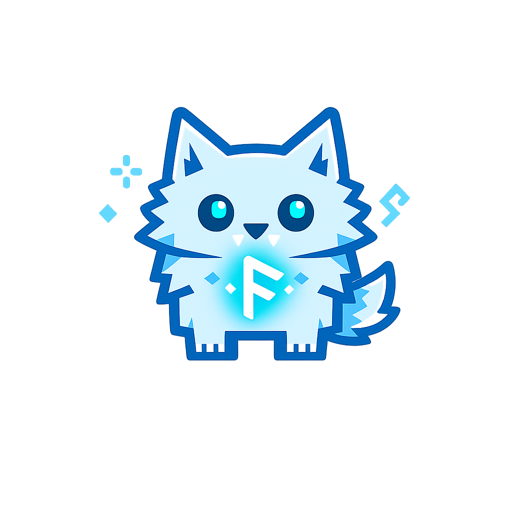
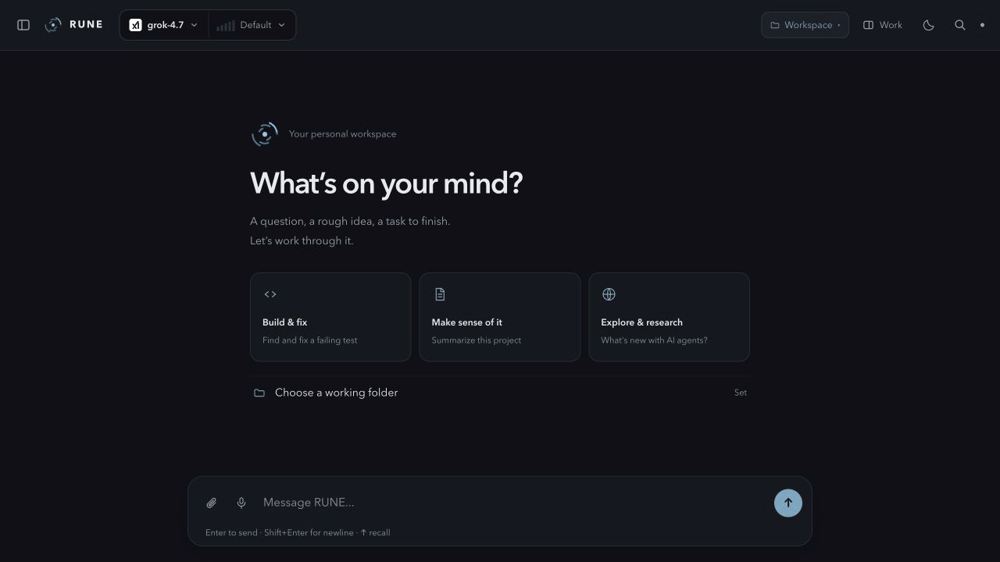
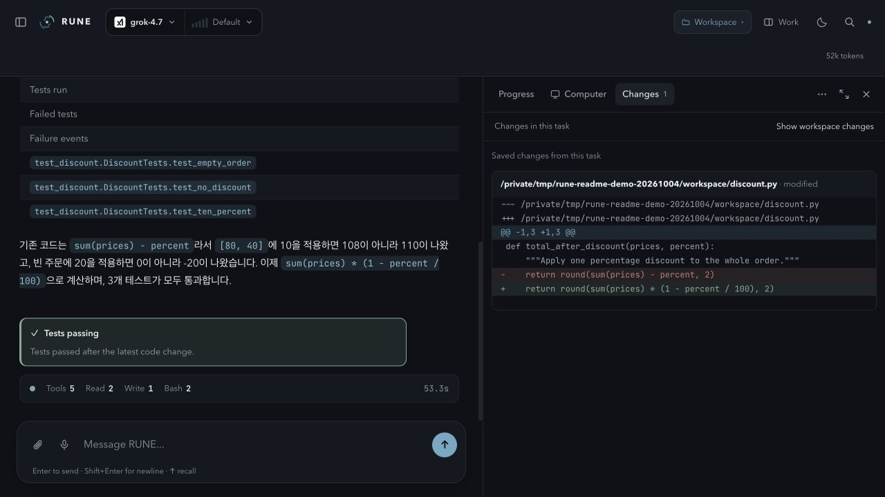
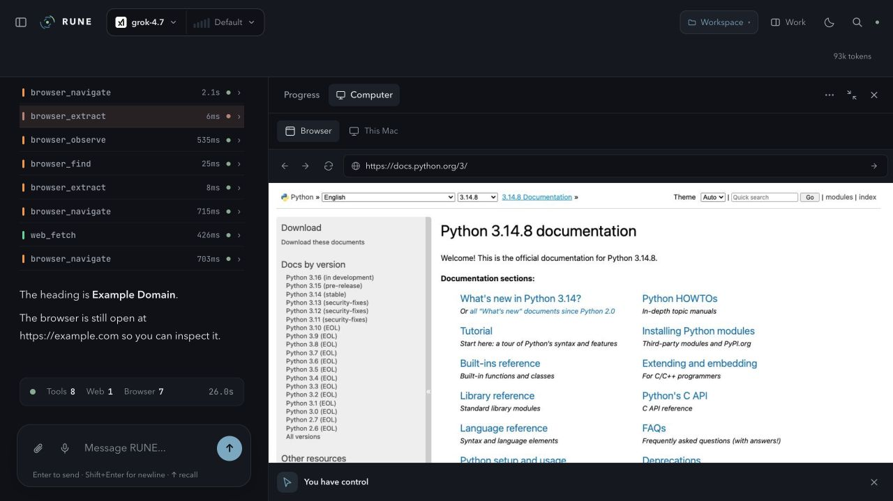
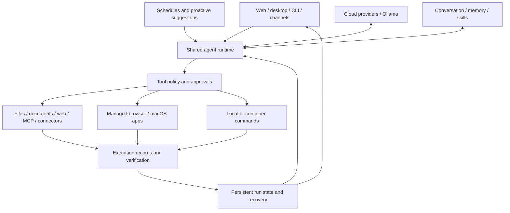

<p align="center">
  
</p>

<h1 align="center">RUNE</h1>

<p align="center"><strong>A local-first agent for code, documents, and everyday work.</strong></p>
<p align="center">Choose your model. Follow the work. Inspect the result.</p>

<p align="center">
  <a href="#quick-start">Quick Start</a> ·
  <a href="#what-rune-can-do">Features</a> ·
  <a href="#computer">Computer</a> ·
  <a href="#architecture">Architecture</a> ·
  <a href="#development">Development</a>
</p>

<p align="center">
  <a href="https://github.com/dybala-21/rune/actions/workflows/ci.yml"></a>
  
  <a href="LICENSE"></a>
</p>

<p align="center">
  
</p>

> Captured from the running app with Grok in an isolated demo workspace. This walkthrough uses selected frames with shortened pauses; it is not a speed benchmark. The code task changes two failing tests to three passing tests without editing the test file.

## Quick Start

### Web app

Requires [uv](https://docs.astral.sh/uv/), Git, Python 3.13+, and Node.js 22+. Run from the repository so the web assets are available:

```bash
git clone https://github.com/dybala-21/rune.git
cd rune
uv sync --extra browser
npm --prefix web ci
npm --prefix web run build
uv run playwright install chromium

# Choose one provider, or use a local Ollama model.
uv run rune env set OPENAI_API_KEY "your-api-key"
uv run rune web
```

The app opens at **http://127.0.0.1:18789/**. Choose a model from the header and a working folder from **Workspace**. Open **Work** to inspect progress, changes, files, or the computer. The [desktop shell](desktop/README.md) uses this same web UI and engine.

### Terminal installation

```bash
curl -LsSf https://raw.githubusercontent.com/dybala-21/rune/main/install.sh | sh
rune env set OPENAI_API_KEY "your-api-key"
rune
```

The installer sets up the CLI and optional dependencies. It does **not** build the web frontend; use the source setup above for the app. Set `RUNE_EXTRAS=none` when invoking the installer for a minimal core installation.

### Providers

RUNE has provider adapters for **OpenAI, Anthropic, Gemini, xAI, Azure, and Ollama**, with Vertex AI credentials supported for Google models. Cloud models use your provider account; Ollama runs models on your machine.

| Provider | Configuration |
|---|---|
| OpenAI | `OPENAI_API_KEY` |
| Anthropic | `ANTHROPIC_API_KEY` |
| Gemini | `GEMINI_API_KEY` |
| xAI / Grok | `XAI_API_KEY` |
| Azure | Deployment, endpoint, API version, and credentials |
| Ollama | A running Ollama service and a downloaded model |

Use `rune env set KEY value` to save a key locally, or supply it through the launch environment. Model selection and supported reasoning options are available in the app. The CLI accepts an explicit provider and model:

```bash
# Replace MODEL_ID with a model available to your account.
rune --provider anthropic --model MODEL_ID --message "Explain this project's auth flow."

# Download a model with Ollama first, then use its installed name.
rune --provider ollama --model MODEL_NAME
```

Local-first describes where RUNE runs and stores its state. Requests sent to a cloud model, search service, or connector still leave your machine.

## What RUNE can do

| Work | Example request | What you can inspect |
|---|---|---|
| **Code** | “Fix the failing discount tests. Keep the tests unchanged and run them again.” | File changes, command output, and test results |
| **Documents and data** | “Read this workbook, reconcile the totals, and produce a report with the discrepancies.” | Source files, generated documents, and supported content checks |
| **Research** | “Compare these sources and explain where they disagree.” | Search results, retrieved pages, and source links |
| **Browser and apps** | “Open this page and complete the form up to the final submission.” | Browser preview, actions, handoff controls, and app permissions |
| **Recurring work** | “Every weekday, check these files and report meaningful changes.” | Schedule, run history, outputs, and execution status |

RUNE can read and generate DOCX, XLSX, PPTX, PDF, CSV, and HTML artifacts. Preview and visual checks depend on the format and available rendering tools. MCP servers add tools from other systems.

### Tools that fit the task

The agent routes work to files, shell commands, web search, APIs, or GUI tools according to the request and available capabilities. It can read a file or run a calculation directly without opening an app. Browser and native app tools are available when the task needs interaction.

Skills are discovered through summaries and loaded when needed. Conversation history, recalled episodes, and compacted context help carry work across turns. These mechanisms support the model; they do not guarantee that every model chooses the best tool or produces a correct answer.

### Results you can check

The work panel separates the current task's changes from the wider workspace. It shows commands, diffs, file previews, and completion evidence.

<p align="center">
  
</p>

Verification is scoped to the evidence collected. **Tests passing** means the recorded checks passed after the code change; it does not prove every requirement or edge case. File existence, content checks, visual review, and model-based requirement review answer different questions. Missing evidence, failed checks, and interrupted work remain visible.

For an unattended coding task with an explicit validation command:

```bash
rune overnight "Fix the failing auth tests" \
  --validate "pytest -q tests/auth" --max-iter 3 --no-escalate
```

`--validate` belongs to `overnight`. For a normal chat or `--message` run, include the required checks in the request. Repeated attempts and model escalation can increase cost.

### Work that survives interruptions

RUNE persists run state, approvals, tool execution records, and recovery information. After an interruption, it can distinguish unfinished work from an action whose effect needs review. An uncertain external action should be inspected before it is retried.

Proactive suggestions and explicitly scheduled work share the runtime, but have separate authorization. Accepting a suggestion is not a blanket grant for later actions. Scheduled routines track relevant inputs and outputs, enforce execution budgets, and can skip work when their tracked state remains unchanged.

## Computer

<p align="center">
  
</p>

After the agent opened a page, we took control, navigated to Python.org, and clicked through to its documentation inside the panel. The chat retains the agent's earlier response while the browser follows the user's input.

- **Browser:** a managed Chromium session in the right panel, with tabs, an address bar, page previews, and action indicators. Browser state is associated with the conversation so follow-up turns can continue the task.
- **Take control:** pause the agent and interact with the preview using clicks, scrolling, and keyboard input. Resume when you are ready.
- **This Mac:** native application access on macOS through the Rune Computer helper. Accessibility, Screen Recording, and app access must be granted before the relevant operations can run.

The managed browser needs Playwright's Chromium installation. It does not require the legacy Browser Bridge extension. Native app control is macOS-specific; browser automation does not imply support for every desktop app or website.

## Configuration and execution

User settings live in `~/.rune/config.yaml`, and saved environment variables in `~/.rune/.env`. Project configuration can override user configuration. `RUNE_HOME` selects a separate state directory; `RUNE_WORKSPACE` sets the default working folder.

### Optional Jev routing

In **Settings → Task routing**, choose **Use current connection** (the default) or **Jev · optional accelerator**. Jev helps identify task requirements and file roles; the selected model still executes the task. Uncertain or unavailable Jev decisions fall back to the current connection, and local-model requests do not go to Jev.

Enabling Jev sends the request and a short previous-request excerpt to TypeSafe and uses its separate billing. It is optional; task features do not require it. Speed and total cost depend on the workload and are not guaranteed to improve.

### Execution boundaries

| Mode | Requirements and scope |
|---|---|
| **Local — default** | Runs on your machine with workspace policies and approval checks. No Docker or VM required. |
| **Container — optional** | Requires Docker. Runs supported commands in a configured container with controlled mounts and network policy. It does not move every tool into the container. |
| **Hosted — experimental** | Linux/Incus tooling for one Rune instance per owner. Requires operator-provided compute, images, storage, and networking; RUNE does not supply cloud resources. |

The connector broker can keep service credentials outside the command workspace and constrain requests by origin, path, and method. It is infrastructure for configured connectors, not a complete catalog of ready-to-use OAuth integrations.

Local policies are not a VM security boundary. Hosted deployments need authentication and a properly configured TLS endpoint. Mobile access can use a hosted web UI; the execution environment remains on the host.

## Architecture


```mermaid
flowchart TD
    UI[Web / desktop / CLI / channels] --> Runtime[Shared agent runtime]
    Schedule[Schedules and proactive suggestions] --> Runtime
    Models[Cloud providers / Ollama] <--> Runtime
    Context[Conversation / memory / skills] <--> Runtime
    Runtime --> Policy[Tool policy and approvals]
    Policy --> Tools[Files / documents / web / MCP / connectors]
    Policy --> Computer[Managed browser / macOS apps]
    Policy --> Execution[Local or container commands]
    Tools --> Evidence[Execution records and verification]
    Computer --> Evidence
    Execution --> Evidence
    Evidence --> State[Persistent run state and recovery]
    State --> Runtime
    State --> UI
```

The web and desktop clients use the same engine. Hosting places that engine behind a separate owner boundary rather than creating a second agent implementation.

## CLI

```bash
rune                                      # Interactive REPL
rune --tui                                # Full-screen terminal UI
rune --message "Explain this project"      # One request
rune --session review --message "Continue" # Continue a named CLI conversation
rune web --no-open                        # Serve the web app without opening a tab
rune daemon start                        # Run the web service in the background
rune daemon stop                         # Stop the background service

rune memory search "query"                # Search stored memory
rune self status                         # Installation information
rune --help                              # All commands and options
```

## Development

From a source checkout, install development dependencies and build the web app:

```bash
uv sync --extra dev
npm --prefix web ci
npm --prefix web run build
uv run playwright install chromium
uv run rune web --no-open
```

For frontend development, run `npm --prefix web run dev` in another terminal. Vite serves the UI and proxies API requests to the local Rune server.

```bash
uv run ruff check .
uv run pytest tests/ -q --tb=short
npm --prefix web test
npm --prefix web run build
```

The default suite skips paid live-model tests. To run the workflow tests against a configured provider explicitly:

```bash
uv run pytest tests/e2e/test_live_workflows.py --run-live \
  --live-provider anthropic --live-model MODEL_ID
```

These tests make real provider calls and incur usage charges. CI also checks shell-policy regressions and a fresh CLI installation. See [the workflow](.github/workflows/ci.yml) for the full checks.

## License

[MIT](LICENSE).
